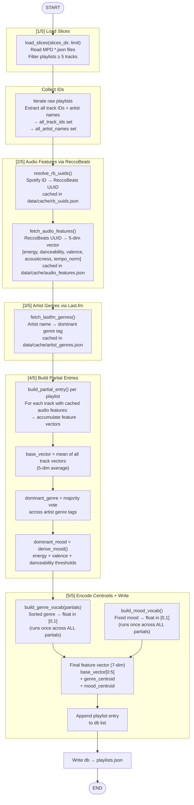

# build_database.py — Pipeline Flow

End-to-end flow of the `main()` function in `build_database.py`.



## Step-by-Step Summary

| Step | Function(s) | Output |
|---|---|---|
| 1 | `load_slices()` | Raw playlist list (≥5 tracks each) |
| 2 | _(inline loop)_ | `all_track_ids` set, `all_artist_names` set |
| 3a | `resolve_rb_uuids()` | Spotify ID → ReccoBeats UUID map (cached) |
| 3b | `fetch_audio_features()` | Track ID → 5-dim audio vector (cached) |
| 4 | `fetch_lastfm_genres()` | Artist name → genre string (cached) |
| 5 | `build_partial_entry()` | Per-playlist: base vector, dominant genre, dominant mood |
| 6a | `build_genre_vocab()` | Global genre → float centroid mapping |
| 6b | `build_mood_vocab()` | Fixed mood → float centroid mapping |
| 6c | _(inline loop)_ | Final 7-dim `feature_vector` per playlist |
| 7 | `json.dump()` | `data/playlists.json` written to disk |

## Feature Vector Dimensions

```
[energy, danceability, valence, acousticness, tempo_norm, genre_centroid, mood_centroid]
   0          1           2          3             4             5               6
```

- **Dims 0–4** (`_base_vector`): mean of per-track ReccoBeats audio features
- **Dim 5** (`genre_centroid`): position of dominant genre in sorted global genre vocab → float in [0, 1]
- **Dim 6** (`mood_centroid`): position of dominant mood in fixed 6-label mood vocab → float in [0, 1]
